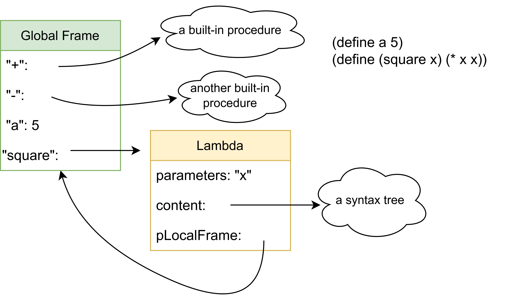
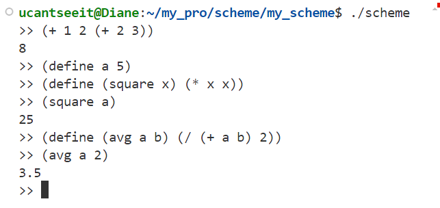

# Scheme_cpp
## 基本情况
本项目是计算机导论课的大作业。这是我为Scheme写的解释器（将Scheme程序转化为C++程序运行）, 灵感来源于CS61a的项目，也参考了@jsun98/LispCC的部分代码。其实早在去年我就开始尝试用C++实现Scheme解释器，奈何水平有限，仅仅写了一个tokenizer和完全没法用的语法树结构。在计算机导论课上，师斌老师第一节课就告诉我们，抽象是计算思维的核心，这与CS61a所传达的理念不谋而合。而编程语言无疑是计算机世界中影响最深远的抽象，因而我选择以这个解释器作为我导论课的大作业项目。
本项目采用C++17标准（主要是使用了variant这一特性来替代union）。这一项目帮助我更好地了解了编程语言与解释器的核心概念，更灵活地使用“树”这一数据结构，熟悉了例如函数指针、union等C++特性，也让我能够更加熟练地使用git, makefile, VScode等工具。由于时间有限，目前只实现了基本加减乘除运算、自定义变量以及自定义函数，很多重要的特性还未实现（例如条件分支）。但是，最核心的部分，即语法树的解析和函数执行环境的逻辑已经实现，剩下的内容我会持续做下去。

## 实现说明
本项目可以大致分为两个部分：第一部分是tokenize.cpp与parse.cpp，负责将用户的输入转化为语法树；第二部分是eval.cpp及其所依赖的env.cpp, special_forms.cpp, built_in.cpp，负责执行语法树所描述的内容。而整个程序的核心则是语法树。
### 1. 语法树的概念与实现
语法树是存储表达式的数据结构，是整个程序中最核心的部分，其实现在SyntaxTree.cpp中。以下是语法树的简单例子：

而在实现时，我则是利用了stl中自带的链表来模拟树，其结构可用下图表示：

### 2. tokenize与parse
tokenize.cpp负责将用户的输入划分为一个一个小token（即string），然后再由parse.cpp将这些token转化为对应语法树。

### 3. 环境与函数
在任何一门编程语言中，用户都可以自定义变量与函数，这是由于程序会有运行环境，记录着用户定义的内容。环境（environment）可以看作由Frame组成的链表，每个Frame都有一个记录变量名和其值的对应关系的表以及其parentFrame的指针。当某个变量名在本地Frame找不到时就顺着指针在parentFrame中找。函数定义时其会记录其所处的Frame。函数运行时会新开一个Frame，这个Frame的parentFrame是函数定义时所记录的Frame，传入的参数会绑定到对应的形参上。下图是一个例子：

函数运行时：

## 运行与测试
命令行中输入make命令完成编译，而后输入./scheme即可启动repl(read-evaluate-print-loop)环境运行。
当前尚未完成异常处理，因而错误的输入会导致不可预知的行为。
运行截图：

